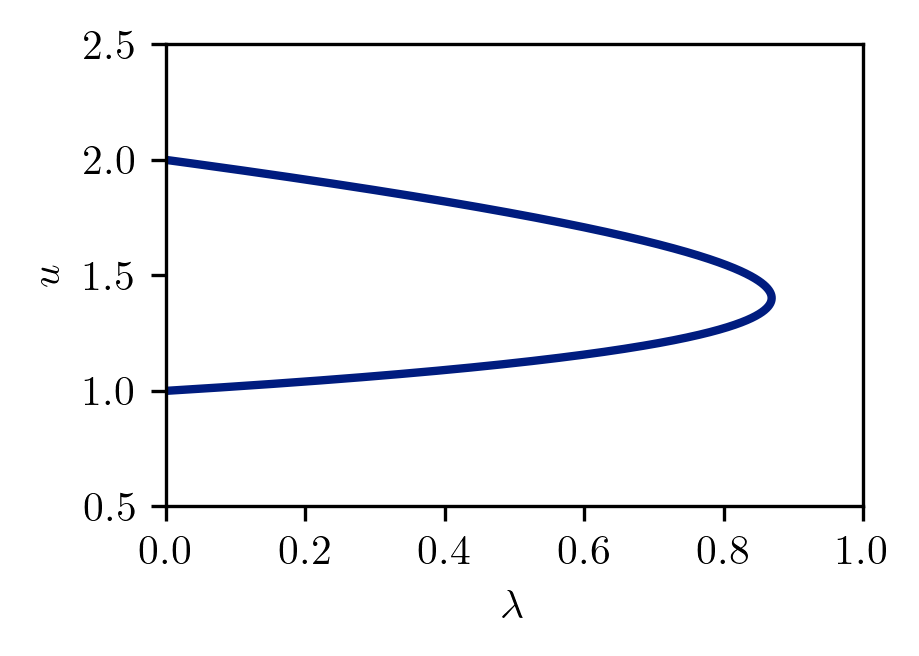
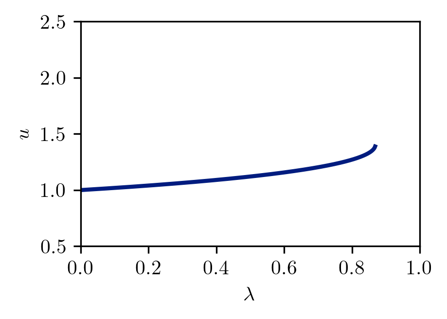

# Toy Example
In this example, we are attempting to find the root of the following equation. 

$g(u,\lambda) = (u^2-1)(u^2 - 4) + \lambda u^2 e^{u/10} = 0$

A given solution will consist of $u$ and $\lambda$. The solution curve has multiple branches. We will do continuation from a known solution of $u(\lambda = 0) = 1$ by varying the parameter $\lambda$. The problem is trivially solved if we fix $u$ and solve for the $\lambda$. The figure below shows the region we are interested in.

    

### Newton Solver for Fixed $\lambda$
We can solve this root equation with a simple Newton solver. Packages exist for this type of solver, but we'll use our own solvers throughout the examples. The source code for the Newton solver can be found at `src/toyExampleNewton.py`.

Mathematically, from an initial guess of $u_0$, we iteratively take Newton steps of the form

$u_{i+1} = u_i - g(u_i,\lambda) /  g_u(u_i,\lambda)$

### Natural Continuation
Natural continuation is the simplest approach to map out the solution curve in $u$ and $\lambda$. From our starting solution of $u(\lambda = 0) = 1$, we trace out our solution curve by taking a step in $\lambda$ and then solving for $u$ using Newton's method. However, if we do this, we run into a problem!

    

If we simply increase $\lambda$, we'll never be able to capture the turning point in the full solution curve. In fact, Newton's method fails for turning points because the derivative $g_u$ goes to zero at a turning point.
